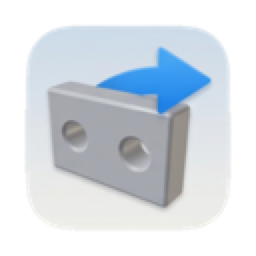
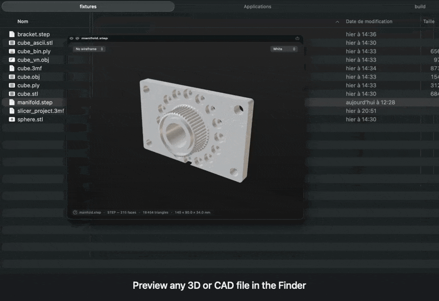

  

<h1 align="center">Peek3D</h1>

Quick Look previews for 3D and CAD files on macOS.

  

---

Press space on an `.stl`, `.obj`, `.ply`, `.3mf`, `.step` or `.iges` file in the
Finder. The part renders and turns. Drag to rotate, pinch to zoom.

**[Download the latest release](https://github.com/oudivad/peek3D/releases/latest)**  19 MB · macOS 13+ · Apple Silicon

Drag into Applications, open once to register the extension, quit, done.

### First launch

Not notarized, so macOS blocks it. Approve under System Settings › Privacy &
Security › Open Anyway.

Run it from Applications.

### STEP and IGES

Exact surfaces, not meshes. Tessellated with OpenCASCADE, bundled as dylibs.

On a dense part the wireframe draws sharp edges only (faces meeting above 25°,
plus open borders) which stays readable where a full triangle mesh does not.

---

[How it works](docs/design.md) · [Build](docs/building.md) · [Limitations](docs/limitations.md)

MIT. Ships OpenCASCADE under LGPL 2.1 with the OCCT exception
([notices](THIRD-PARTY.md)).
